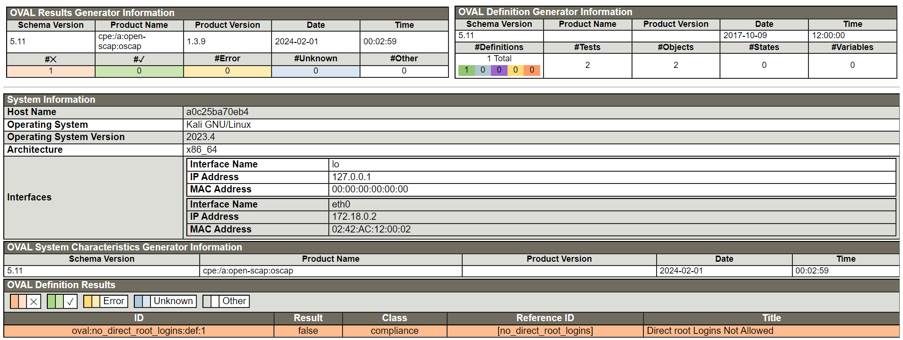

# kali-traefik-cybersec-ops
A containerized environment for testing various cybersecurity tools.
Examples:
* Using Kali Linux to securely attack
* Using Traefik reverse proxy with a self-signed CA to defend
* Using DISA-STIG, OVAL, and XCCDF for cybersecurity compliance

## Part 1 - Self-signed CA Certificate TLS/SSH
### Requirements:
* OpenSSL - Generates the CA certificates and keys for signing
* Traefik - Servs the certs and acting as gateway/reverse-proxy
* Firefox - Easy to import custom certificates (other browsers work too)

### Purpose:
* Avoid the need for a public domain and server

### Procedure:
1. Execute:
   create-certs.sh
   1. This will create the ca-cert.crt certificate
2. Open your browser (tested with Firefox) and navigate to the privacy and security settings
   1. Here you can find the certificates store and import the ca-cert.crt
   2. Your browser will then trust anything signed with this ca-cert.crt (domain names in this example)

## Part 2 - Instantiate Containerization Environment
### Requirements:
* Docker - Containerization tool including Docker Compose for multi-container environments

### Purpose:
* Start up the offensive and defensive containers for testing and execution

### Procedure:
1. Execute:
   ```
   docker network create web
   docker compose up -d
   ```
   2. This will create and start the containers defined in the docker-compose.yml file.

## Part 3 - Cybersecurity & Cryptography
### Requirements:
* Kali Linux - Docker image with cybersecurity and IT tools
* GnuTLS - SSL/TLS library
* OpenSCAP - Configuration audit tool for images and operating systems
* OVAL - Open Vulnerability Assessment Language (XML format) for audit checks
* XCCDF - Checklists for OVAL and remediation (XML format)

### Purpose:
* Start up the offensive and defensive containers for testing and execution

### Procedure:
1. Execute:
```
   cybersec-check.sh
```
2. Results:
   1. GPG - Using AES encryption
      * Create a key
      * Encrypt a message
      * Decrypt a message
   2. OpenSSL - Calculate the HMAC of a message before and after encrypt/decrypt for integrity
   3. OpenSCAP - Audit the security of the Kali docker image
      * 
   3. GnuTLS - Check Cipher Suites Supported by my personal website: [https://www.michaelthamm.com](https://www.michaelthamm.com)
      * For example:
      * TLS_AES_128_GCM_SHA256 0x13, 0x01	TLS1.3
      * TLS_AES_256_GCM_SHA384 0x13, 0x02	TLS1.3
      * TLS_CHACHA20_POLY1305_SHA256 0x13, 0x03	TLS1.3
      * TLS_AES_128_CCM_SHA256 0x13, 0x04	TLS1.3
      * TLS_AES_128_CCM_8_SHA256 0x13, 0x05	TLS1.3
   4. GnuTLS - Server Handshake for Cert Information of my personal website: [https://www.michaelthamm.com](https://www.michaelthamm.com)
      * The result gives some information about the cipher suite:
      * (TLS1.3-X.509)-(ECDHE-X25519)-(RSA-PSS-RSAE-SHA256)-(AES-256-GCM)
